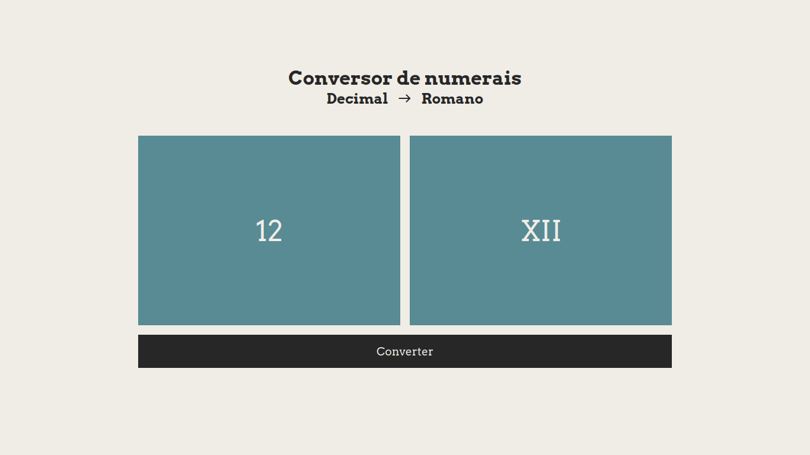
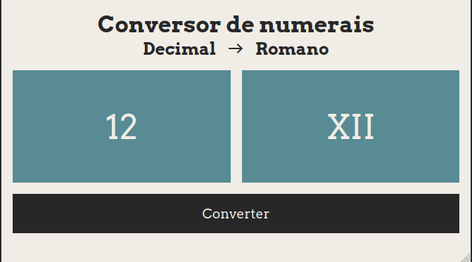
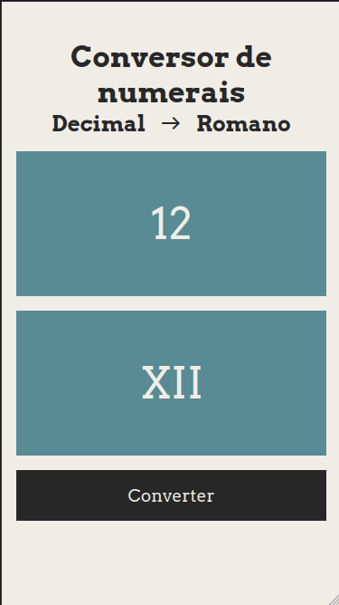

# Conversor de numerais romanos

Esta aplicação realiza a conversão de um número decimal para algarismos romanos. O raciocínio lógico utilizado no JavaScript foi desenvolvido para minha avaliação na plataforma freeCodeCamp.

## :gear: Tecnologias

- HTML
- CSS
- JavaScript

## :art: Layout

